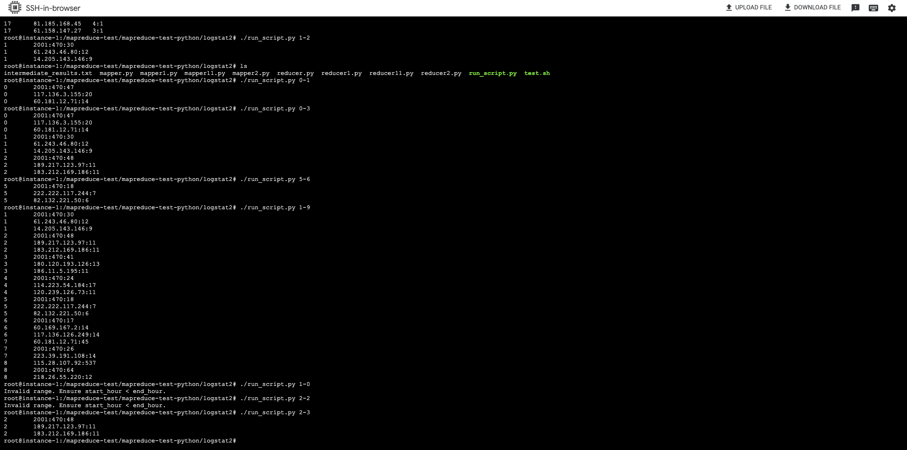

## To show  the top-3 IPs for each hour:

First run the following command:
```bash
cat ../../mapreduce-test-data/access.log | python mapper.py | sort -k1,1 | python reducer.py > intermediate_results.txt
```

And then run the following command:

```bash
cat intermediate_results.txt | python mapper11.py | sort -k1,1 | python reducer11.py
```

## running the code:

```bash
 Python ./scripts/run_script.py 1-2
```


If the log data does not contain any entries for the specified hour range, the script will not output anything but it will also not yield an error. 


 If you strictly want to run it without run_script.py then you need to manually export the environment variables FROM_HOUR and TO_HOUR in the shell before running the command:

 ```bash
export FROM_HOUR=0
export TO_HOUR=1
cat ../../mapreduce-test-data/access.log | python mapper1.py | sort -k1,1 | python reducer1.py > intermediate_results.txt
 ```





# Files in the directory:
```bash
mapreduce/
│
├── mappers/
│   ├── mapper.py
│   ├── mapper1.py
│   ├── mapper11.py
│
├── reducers/
│   ├── reducer.py
│   ├── reducer1.py
│   ├── reducer11.py
│   ├── reducer2.py
│
├── scripts/
│   ├── run_script.py
│
├── data/
│   ├── access.log
│   ├── intermediate_results.txt
│
├── screenshots/
│   ├── screen_shot1.png
│   ├── screen_shot2.png
│
└── readme.md
```
mapper.py: This file contains the code for the first map reduce. It reads the access.log file and outputs the IP address and the hour of the log entry.

reducer.py: This file contains the code for the first reduce. It reads the output of the first map reduce and outputs the IP address and the hour of the log entry.

mapper1.py: This file contains the code for the second map reduce. It reads the intermediate_results.txt file and outputs the IP address and the hour of the log entry.

reducer1.py: This file contains the code for the second reduce. It reads the output of the second map reduce and outputs the top 3 IP addresses for each hour.


mapper11.py: This file contains the code for the second map reduce. It reads the intermediate_results.txt file and outputs the IP address and the hour of the log entry.

reducer11.py: This file contains the code for the second reduce. It reads the output of the second map reduce and outputs the top 3 IP addresses for each hour.

intermediate_results.txt: This file contains the output of the first map reduce. It is used as input for the second map reduce.


